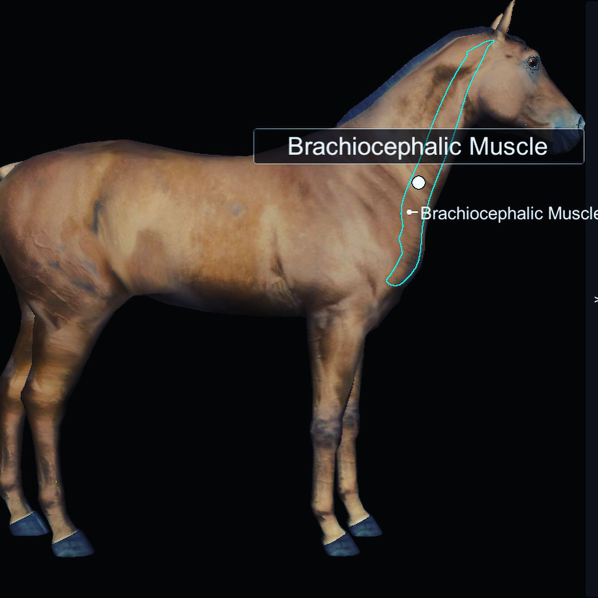

#### Mięsień ramienno-głowowy (w uproszczeniu) rozpoczyna się na kości skroniowej, wyrostkach poprzecznych kręgów szyjnych i ciągnie się aż do kości ramiennej.

---

📌 Co robi?

Zgina szyję i przekręca głowę w bok, unosi kończynę w stronę głowy i ciągnie łopatkę do przodu, podnosi ją i przesuwa kończynę do przodu.
Co możemy wyczuć?

📌 Czesto bywa spięty!

Tkliwość mięśnia występuje przy przewlekłej kulawiźnie, niewłaściwej postawie, nieprawidłowym treningu oraz przebytych urazach.

📌 Dlaczego jest tak ważny?

Ponieważ jego kondycja jest kluczowa w prawidłowej pracy ramienia i kończyny przedniej oraz podczas zgięć bocznych.

#### Zadbajmy razem o zdrowe mięśnie Twojego konia‼️

---
